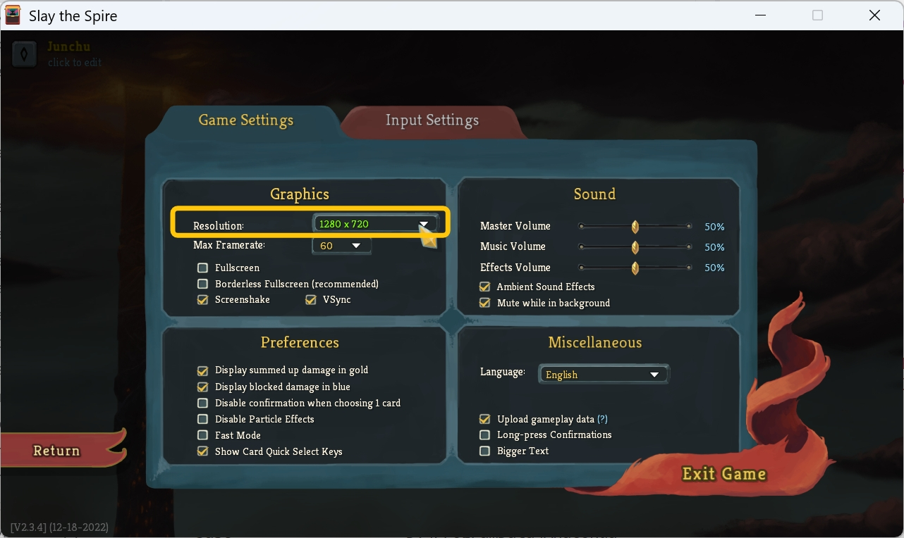
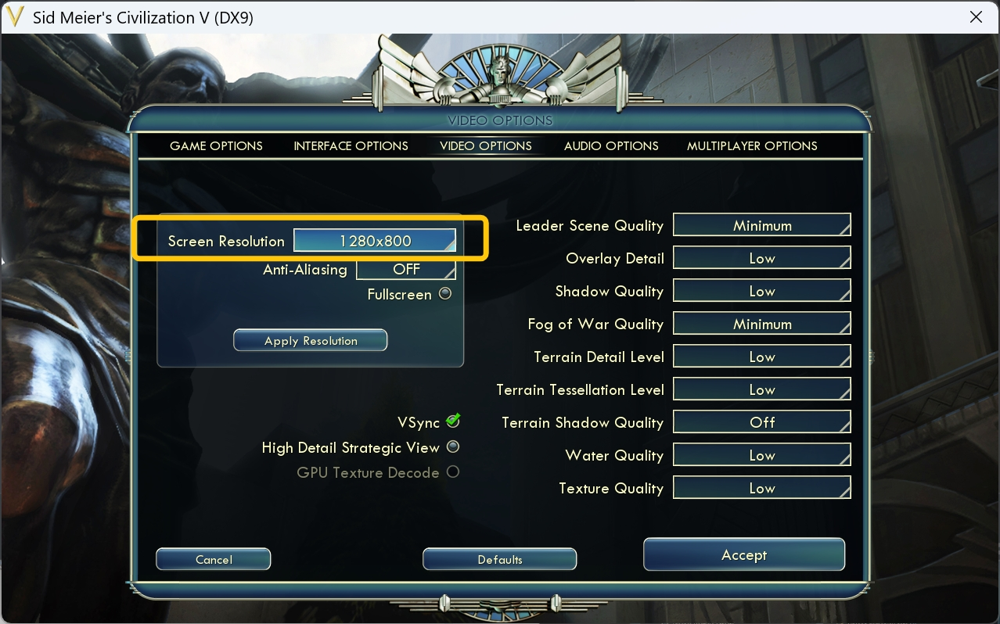
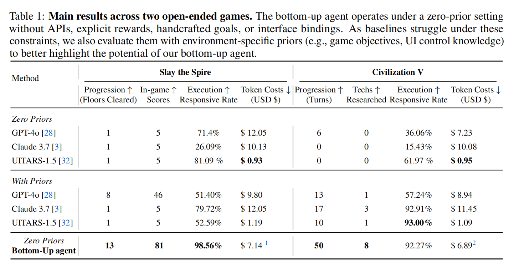

# BottomUpAgent
## Rethinking Agent Design: From Top-Down Workflows to Bottom-Up Skill Evolution


<div align="center">

[](https://arxiv.org/abs/2505.17673)  []()  []()


</div>

## Introduction

This repository contains the official implementation of the paper  
**“Rethinking Agent Design: From Top-Down Workflows to Bottom-Up Skill Evolution”**.  
Our bottom-up agents learn skills through autonomous exploration and reasoning—starting from raw pixel inputs and simulated mouse/keyboard actions, evolving competence purely from experience.


## Project Highlights

- **Zero-prior Learning**: Agents operate without predefined goals, APIs, or game knowledge.  
- **Unified Codebase**: One framework supports multiple environments (e.g., Slay the Spire, Civilization V).  
- **Experience-Driven Evolution**: Skills are discovered, refined, and shared dynamically across agents.  
- **Visualization**: Execution states and skill libraries can be visualized via integrated GUIs and logs.

## Demo

| Environment                                                                 | Demo GIF                                           |
|:---------------------------------------------------------------------------:|:--------------------------------------------------:|
| [Slay the Spire](https://www.megacrit.com/games/#slay-the-spire)           |  |
| [Civilization V](https://civilization.2k.com/civ-v/)                       |  |

# Table of Contents

- [Installation](#installation)  
- [Usage](#usage)  
- [Results](#results)  
- [Citation](#citation)  
- [License](#license)  

# Installation
> 💡 Currently, our implementation supports **Windows** only.  
We select games based on the principle of **cross-platform availability via Steam**, ensuring support across **Windows**, **macOS**, and **SteamOS/Linux**, and will improve the adaptation for all platforms in the future.

## 1. Clone the repository 
```bash
git clone https://github.com/AngusDujw/Bottom-Up-Agent.git
cd Bottom-Up-Agent
```


## 2. Create & activate a Conda environment 
```bash
conda create -n bottomup python=3.10 -y
conda activate bottomup
```

## 3. Install dependencies
```bash
pip install -r requirements.txt
```

## 4. Configure API keys

We currently support both OpenAI and Claude APIs. 
Create a `.env` file inside the `base_model/` directory with your credentials:
```bash
# base_model/.env
OPENAI_API_KEY=your_openai_api_key_here
ANTHROPIC_API_KEY=your_anthropic_api_key_here
UI_TARS_API_KEY=your_ui_tars_api_key_here  # for ui-tars baseline, optional for just running the games
```

## 5. Configure Weights & Biases (wandb)
```bash
wandb login # enter your WandB API key when prompted
```
## 6. Download & configure the SAM model
  - Download the SAM weights (e.g., `sam_vit_h_4b8939.pth`,`sam_vit_b_01ec64.pth`) from the [Segment Anything Model](https://github.com/facebookresearch/segment-anything) release.
  - Place the file under the root project’s `weights/` folder:
```bash
mkdir -p weights
cd weights
curl -O https://dl.fbaipublicfiles.com/segment_anything/sam_vit_b_01ec64.pth
cd ..
# weights/
# ├── sam_vit_b_01ec64.pth
# └── sam_vit_h_4b8939.pth
```


# Usage
> **⚠️ Note:** Before running the agent, make sure the target game is already launched and in the main interface. 
> Starting from the main menu may result in excessive exploration of non-essential menus.

## Launch the games from Steam<sup>®</sup>
Download the licensed Slay and Spire, Civilization V from Steam, then launch the game.
For Slay the Spire, select `Play Slay the Spire` option.
For Civilization V, select `Play Sid Meier's Civilization V (DirectX 9)` option.

## Screen settings
Please adjust the in-game resolution to match the `width` and `height` specified under the `eye` attribute in your `config/*.yaml` configuration files. This ensures the agent observes the window correctly.
| Slay the Spire | Civilization V |
|------------|------------|
|  |  |


## Run on Slay the Spire
```bash
python -m run --config_file "config/sts_explore_claude.yaml"
```

## Run on Civilization V
```bash
python -m run --config_file "config/c5_explore_claude.yaml"
```

## Control
To navigate through the game steps, follow these instructions:
1. When prompted in the terminal, press `[` to initiate a new step.
2. When you see `end action evolution` in the terminal, it signals the end of the current step. At this point, you will need to manually perform some actions in-game to progress to the next step.
3. Press `/` to exit dev mode and save the checkpoint of the current run.
   
## Visualize
To visualize the agent's performance, ensure you are in the same conda environment and run the following command **from a new terminal**:
```bash
python BottomUpAgent/visualization.py
```
This starts a server for visualizing **the agent's skill trees and invocation logs** at http://localhost:5000.


# Results

For detailed experimental results and further analysis, please refer to the [full paper](https://arxiv.org/abs/2505.17673).

# Citation
If you find our research useful, please cite it as follows:

```
@article{du2025rethinking,
    title={Rethinking Agent Design: From Top-Down Workflows to Bottom-Up Skill Evolution},
    author={Jiawei Du and Jinlong Wu and Yuzheng Chen and Yucheng Hu and Bing Li and Joey Tianyi Zhou},
    journal={arXiv preprint arXiv:2505.17673},
    year={2025}
}
```

# License
This project is licensed under the MIT License. See LICENSE for details.